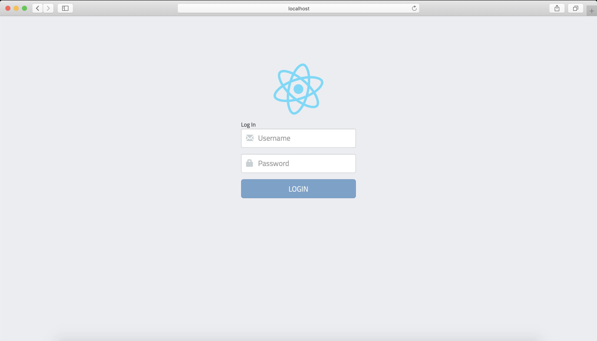
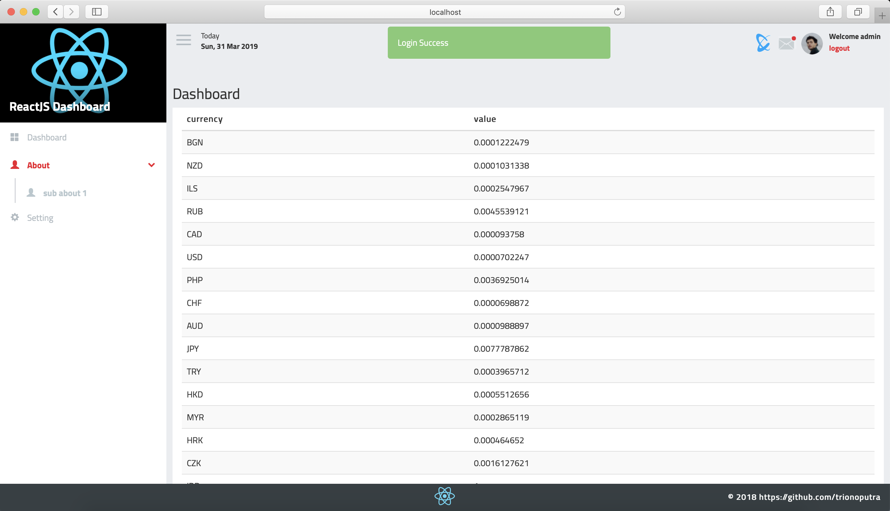
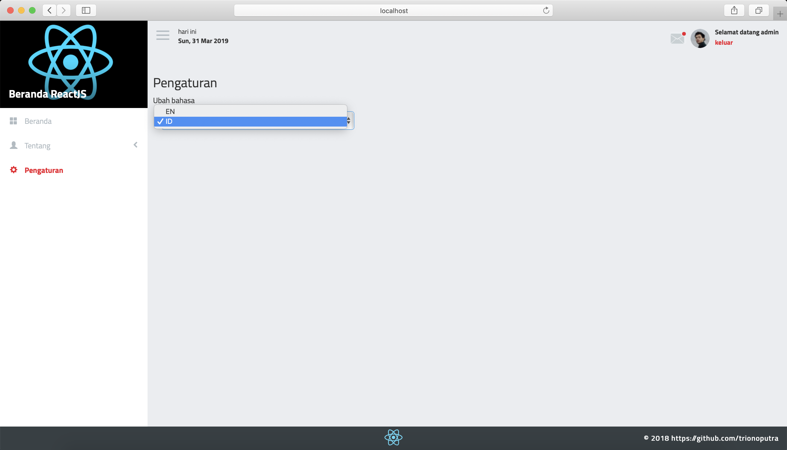

# ReactJS Dashboard

Starter project for a ReactJS Dashboard

## Prerequisites

- [Git](https://git-scm.com/)
- [Node.js and npm](nodejs.org) Node 10.15.2, npm 6.4.1

## Dependencies

- [history : ^4.9.0](https://github.com/ReactTraining/history)
- [http-build-query](https://github.com/vladzadvorny/http-build-query)
- [moment : ^2.24.0](https://momentjs.com)
- [react : ^16.8.6](https://reactjs.org)
- [react-bootstrap : ^0.32.4](https://react-bootstrap.github.io)
- [react-dom : ^16.8.6](https://reactjs.org/docs/react-dom.html)
- [react-intl : ^6.0.1](https://github.com/yahoo/react-intl)
- [react-redux : ^5.4.10](https://github.com/reduxjs/react-redux)
- [react-router-dom : ^5.0.0](https://github.com/ReactTraining/react-router)
- [react-scripts : 2.1.8](https://github.com/facebook/create-react-app)
- [react-sidebar : ^3.0.2](https://github.com/balloob/react-sidebar)
- [react-sidemenu : ^1.1.0](https://github.com/fortunar/react-sidemenu)
- [redux : ^4.0.1](https://redux.js.org)
- [redux-thunk : ^2.3.0](https://github.com/reduxjs/redux-thunk)

## Installation
```sh
$ git clone https://github.com/trionoputra/reactjs-dashboard.git
$ cd reactjs-dashboard/
$ npm install
$ npm start
```
</img>
</img>
</img>

## Features
- Login Page
- API Service
- Message Notification
- Multi-language
- State Management / Redux
- Side Navigation Menu
- Multi-level dropdown menu
